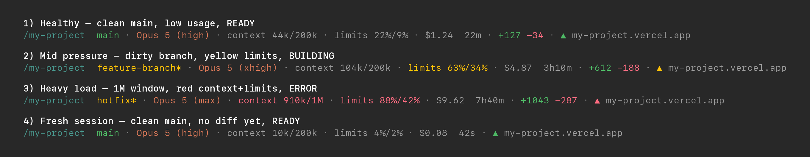

# claude-statusline

A custom statusline for [Claude Code](https://claude.com/claude-code): active model & effort level, rate-limit usage, context window, session cost & duration, lines added/removed, and an optional live Vercel deployment indicator. Visual clusters separated by dim dots.



Plain-text rendering of one scenario:

```
/my-project  feature-branch* · Opus 5 (xhigh) · context 280k/1M · limits 38%/12% · $0.85  12m · +127 -34 · ▲ my-project.vercel.app
```

## Features

- **Path + branch** — `/dir` in teal, branch in green; amber with a `*` when the tree is dirty
- **Model + effort** — `Opus 5 (xhigh)`: what is actually driving the session, following `/effort` live rather than the saved default
- **Context window** — `280k/1M`: tokens used out of the window size, using the same figure Claude Code's own percentage divides
- **Plan rate limits** — `limits 5h%/7d%`, colored by the higher of the two
- **Session cost** — theoretical API price for the current session
- **Session duration** — wall-clock time the assistant has been working
- **Session diff** — `+N -N` lines added / removed; auto-hides on a fresh session
- **Vercel deployment triangle** *(optional)* — `▲` colored by the latest deployment state for the current branch
- **Matches your Claude Code theme** — see [Theme](#theme)
## Requirements

- macOS (Intel or Apple Silicon). Linux/Windows ports welcome via PR.
- Claude Code CLI
- `python3` on `$PATH` (ships with recent macOS)
- 24-bit color support (any modern terminal, or the Claude Code desktop app) — the palettes are truecolor values, not ANSI indices
- For the optional Vercel dot:
  - [Vercel CLI](https://vercel.com/docs/cli) (`npm i -g vercel`)
  - A Vercel account with at least one linked project

## Install

```bash
git clone https://github.com/nathansimony/claude-statusline.git
cd claude-statusline
./install.sh
```

The installer:
1. Copies `lib/statusline.sh` → `~/.claude/statusline.sh`
2. Adds a `statusLine` block to `~/.claude/settings.json` (existing file is backed up to `.bak`)
3. Offers to pin your theme, if it's set to `auto` and your terminal turns out to be light — see [Theme](#theme)
4. Asks whether to set up the Vercel dot. If yes:
   - Generates a random ntfy.sh topic (acts as a shared secret)
   - Creates a Vercel webhook subscribed to `deployment.created`, `deployment.canceled`, `deployment.error`
   - Installs a launchd agent that streams events from ntfy.sh and writes deployment state to `/tmp` cache files

Restart Claude Code (or run `/config`) after installing to pick up the new statusline.

## Theme

The statusline reads the same `theme` key that `/theme` writes, and both of its palettes are lifted from Claude Code's own theme tables — so it paints itself the colors the interface above it is using.

It resolves the theme in three steps, stopping at the first that answers:

1. **An explicit theme in `settings.json`** — anything starting `light` → light palette, anything starting `dark` → dark palette. The colorblind-friendly and ANSI variants fold into their families
2. **`COLORFGBG`**, if your terminal exports it (Konsole, rxvt, iTerm2 with the option on) — parsed the way Claude Code parses it
3. **Otherwise dark**

Settings are read in Claude Code's own precedence order — `~/.claude/settings.json`, then `settings.local.json`, then the same pair inside the project directory — and the last file naming a theme wins. Changes take effect on the next render; there is nothing to restart, because the script is re-executed every time.

### Why `auto` lands on dark

Claude Code resolves `auto` by asking the terminal for its background over OSC 11, then holds the answer in memory. It never reaches disk and it is not in the data handed to the statusline. The statusline cannot repeat the query either: it runs while Claude Code holds the tty in raw mode, so the terminal's reply would arrive in Claude Code's input stream rather than here.

So on `auto` it falls back exactly as Claude Code does when nothing answers — `COLORFGBG`, else dark. On a light terminal that means a dark statusline under a light interface.

**Fix:** pick "Light mode" in `/theme`. `install.sh` also catches this, since it runs before any TUI holds the tty and can therefore ask the terminal safely: finding `auto` plus a light background, it offers to set the theme for you. It stores nothing of its own — a cached background would go stale the moment you switched terminal profile, and would describe the terminal you installed from rather than the one you work in.

## Uninstall

From the cloned repo:

```bash
./uninstall.sh
```

This removes the scripts, unloads the launchd agent, and strips the `statusLine` block from `settings.json`. The Vercel webhook on your account is **not** auto-removed — see the uninstall output for the manual command.

## How the Vercel dot works

```
Vercel webhook (deployment.created / canceled / error)
  → POST https://ntfy.sh/<your-topic>
  → ~/.claude/vercel-subscriber.sh (long-lived curl -sN stream)
  → /tmp/claude-statusline-vercel-<sha1(projectId-branch)>
  → ~/.claude/statusline.sh reads cache on render
```

When a `deployment.created` event arrives, the subscriber writes `BUILDING` to the cache and spawns a bounded poll loop that polls the Vercel API every 5s until the deployment reaches a terminal state (READY/ERROR/CANCELED), then exits. Net result: ~6 API calls per deployment, zero idle polling.

**Trade-offs:**
- ntfy.sh is a free public pub/sub service. Your topic name is the only thing keeping the events private — the installer generates 128 bits of randomness for it, so it's effectively unguessable, but you can rotate it by deleting `~/.claude/vercel-webhook-topic` and re-running the installer.
- The bounded poll uses your Vercel auth token. If it expires, BUILDING → READY transitions stop working (BUILDING/ERROR/CANCELED still fire via push). Run `vercel login` again to fix.

## Customizing

Open `~/.claude/statusline.sh` and edit. Common changes:

| Change | Where |
|---|---|
| Color thresholds | `if [ "$ctx_used" -ge 85 ]` / `if [ "$hi" -ge 80 ]`. Defaults: context turns yellow at ≥70% and red at ≥85%; limits turn yellow at ≥50% and red at ≥80%, keyed on the higher of the two |
| Colors themselves | The `# --- palette ---` block near the top — two branches, one per theme, each defining `$c_claude`, `$c_success`, `$c_error`, `$c_warning`, `$c_inactive`, `$c_border`, `$c_plan`. Edit the branch for the theme you use, or both |
| Theme detection | The `resolve_theme()` function in the `python3` block — mirrors Claude Code's own precedence (explicit setting → `COLORFGBG` → dark). Hardcode a return value to pin one theme |
| Cluster grouping | The bottom of the script: `identity`, `engine`, `context`, `limits`, `metrics`, `diff`, `deploy` variables — move a `$..._str` into a different cluster, or add/remove a cluster line |
| Effort as words vs. a meter | The `case "$effort"` block in the engine segment — swap the parenthesised words for glyphs. If you use glyphs, keep them within one East Asian Width class or the segment shifts column between levels |
| Separator character | The `sep=` line near the bottom: change `·` to `│`, `▸`, `—`, etc. |
| Drop a segment | Comment out its block; it falls out of its cluster automatically (empty clusters get no separator) |
| Add a field | Extract from the JSON blob inside the top `python3 -c` block, add a new `${...}_str` segment, drop it into a cluster |

The full JSON Claude Code pipes in includes more fields than we use: `session_id`, `session_name`, `output_style`, `fast_mode`, `thinking.enabled`, `exceeds_200k_tokens`, `cost.total_api_duration_ms`, `worktree`, `pr`, etc. Dump a sample by adding this at the top of the script:

```bash
echo "$input" > /tmp/last-input.json
```

then inspect with `python3 -m json.tool < /tmp/last-input.json`.

## Troubleshooting

| Symptom | Check |
|---|---|
| No statusline at all | `cat ~/.claude/settings.json` — does it have a `statusLine` block? |
| Garbled escape codes | Your terminal might not handle ANSI (or OSC 8). This script avoids OSC 8 deliberately. |
| Vercel dot never appears | `cat /tmp/claude-vercel-subscriber.log` — daemon running? Webhook firing? Topic correct? |
| Dot stuck on BUILDING | Vercel auth token expired. Run `vercel login`. |
| `limits` segment missing | You're on an older Claude Code version that doesn't expose `rate_limits`. Upgrade. |
| No `(effort)` after the model | That model doesn't support effort — Haiku 4.5, Sonnet 4.5, Opus 4.1 and older. Claude Code omits the field entirely and the parenthetical drops out. |
| An ultracode session shows `(xhigh)` | Correct, and unavoidable: Claude Code normalizes ultracode to `xhigh` before the statusline sees it, so the two are indistinguishable here. |
| Context reads `28%` instead of `280k/1M` | The payload was missing `total_input_tokens` or `context_window_size`; the statusline falls back to the bare percentage rather than inventing a number. |
| Colors don't match your theme | The script reads `theme` from `settings.json` (user, then project, then their `.local` variants). Check with `python3 -c "import json;print(json.load(open('$HOME/.claude/settings.json')).get('theme'))"`. If it's `auto`, it resolves to dark unless `COLORFGBG` says otherwise — set `theme` explicitly via `/config` to pin it. |
| Colors ignored entirely | Terminal lacks 24-bit color. Check with `printf '\\033[38;2;215;119;87mtest\\033[0m\\n'` — if that isn't orange, replace the `38;2;R;G;B` codes with basic ANSI (`31`–`37`, `90`). |

## License

MIT — see [LICENSE](LICENSE).
